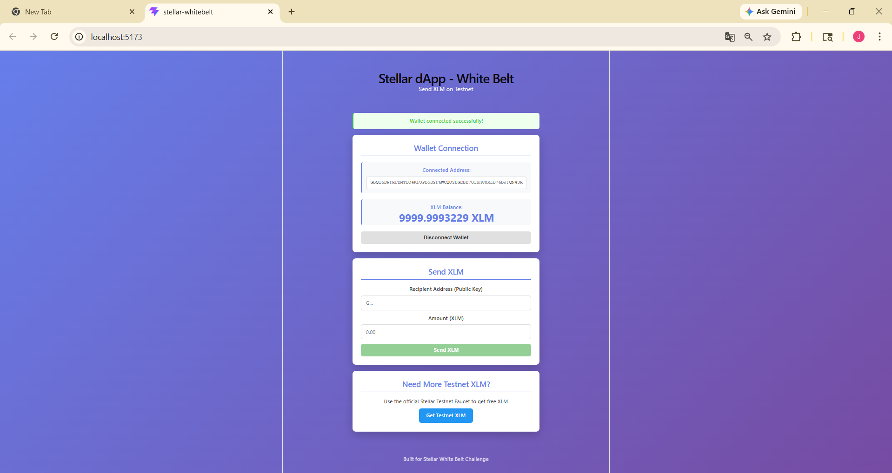
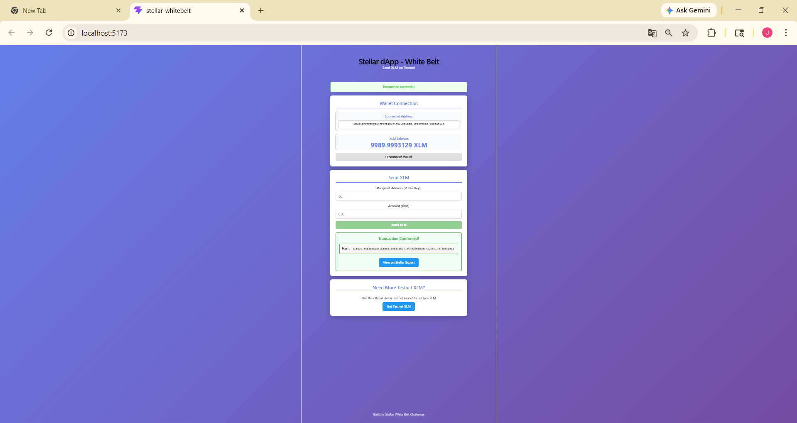

# Stellar dApp - White Belt 🌟

A simple Stellar dApp built on Testnet that allows users to connect their Freighter wallet, view their XLM balance, and send XLM transactions.

## Features

- Connect / Disconnect Freighter Wallet
- Display XLM balance (auto-refreshes every 10s)
- Send XLM to any Stellar testnet address
- Transaction feedback (success/failure + transaction hash)
- Link to view transaction on Stellar Expert

## Tech Stack

- React + Vite
- @stellar/stellar-sdk
- @stellar/freighter-api
- Stellar Testnet (Horizon)

## Setup Instructions

### Prerequisites

- Node.js (v18+)
- [Freighter Wallet](https://freighter.app) browser extension
- Git

### Installation

```bash
# Clone the repository
git clone https://github.com/YOUR_USERNAME/stellar-whitebelt.git

# Navigate to project folder
cd stellar-whitebelt

# Install dependencies
npm install

# Start the development server
npm run dev
```

Open your browser and go to `http://localhost:5173`

### Freighter Wallet Setup

1. Install [Freighter](https://freighter.app) browser extension
2. Create or import a wallet
3. Switch network to **Testnet**
4. Get free testnet XLM from [Friendbot](https://friendbot.stellar.org)

## Screenshots

### Wallet Connected + Balance Displayed


### Successful Transaction
[](https://github.com/jayantvaibhavspj/stellar-whitebelt/blob/170de6c31bbafbfcf889989a9e8548901b1d25fe/screenshots/transaction-success.png.png)

## Built For

[Stellar White Belt Challenge](https://risein.com)
